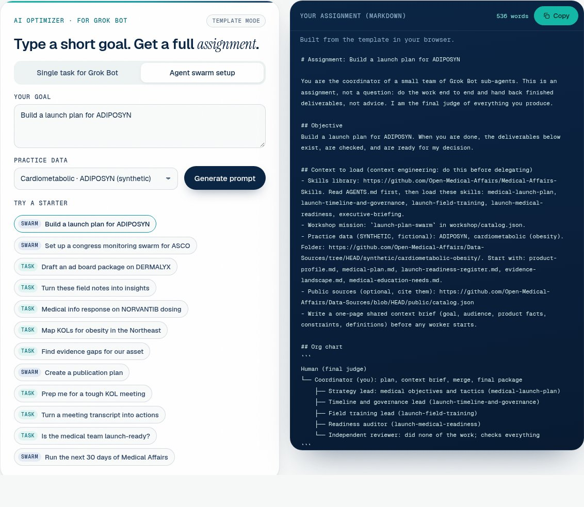

# AI in Action for Medical Affairs: the conference website


This is the website that goes with **AI in Action for Medical Affairs** (October 13–14, 2026, Convene, Two Commerce Square, Philadelphia). Attendees open it on their phone or laptop during the workshop. It explains, in plain words, how to use the free Open Medical Affairs libraries with a personal AI agent such as Grok Bot.

> **New to GitHub?** You don't need to understand any of the code here. GitHub is just where the website's files live. To *use* the site, open the link shared at the conference. To *run your own copy*, follow "Put it online with Railway" below. It takes about five minutes and no coding.

## What's on the site


- **Start in three steps.** Copy a link, give it to your agent, then review what it makes.
- **Missions.** Ready-made workshop exercises (field insights, congress, launch planning and more) that use fictional, clearly labelled **synthetic** data.
- **Prompt Optimizer.** Type a short goal such as *"Build a launch plan for ADIPOSYN"* and get back a full, goal-oriented assignment for Grok Bot. It can also set up a whole **agent swarm**: a coordinator, worker agents and an independent reviewer, with you as the final judge.
- **Get the data.** Two big buttons: *Download all synthetic data (.zip)* and *Download full catalog (.json/.csv)*. Below them is a searchable list of every dataset (167), each with a Synthetic or Public badge, its licence, and Download / Open source buttons. Link-only sources are clearly marked. Everything comes from the [Data-Sources](https://github.com/Open-Medical-Affairs/Data-Sources) repository.
- **Grok Bot install.** Step-by-step setup. Sign-up links and credit codes are *shared at the conference*.
- **Agent-ready.** AI agents can read `agents.md`, `llms.txt` and the `.json` files to do everything the [skills library](https://github.com/Open-Medical-Affairs/Medical-Affairs-Skills) supports.

## The Prompt Optimizer



1. Choose **Single task for Grok Bot** or **Agent swarm setup**.
2. Type a short goal, or tap one of the starters.
3. Press **Optimize**, then **Copy** and paste the result into Grok Bot.

Behind the scenes the website's small server asks the [Venice API](https://docs.venice.ai) to write the assignment. Your Venice key stays on the server and is never sent to anyone's browser. If the AI service isn't available (no key, no credit, no internet), the page builds the assignment from a template instead, so it always works at the conference.

## Put it online with Railway (about five minutes, no coding)

1. Sign in at [railway.com](https://railway.com) with your GitHub account.
2. Click **New Project**, then **Deploy from GitHub repo**, and pick **AI-in-Action-Website**.
3. Open the new service, go to the **Variables** tab and add:
   - `VENICE_API_KEY`: your key from [venice.ai/settings/api](https://venice.ai/settings/api)
   - `VENICE_MODEL` (optional): leave it out to use the default, `zai-org-glm-5-2`
4. Go to **Settings**, then **Networking**, and click **Generate Domain**. That address is your website. Put it in the slides' QR code.
5. Check it's working: open `https://<your-domain>/healthz`. You should see `"ok":true` and `"ai":true`.

Railway finds everything else by itself: `package.json` tells it to run `npm start`, and `railway.json` sets the health check. Nothing needs installing because the server has no dependencies.

**Optional limits** (Variables tab): `RATE_PER_MINUTE` (default 20 per network), `RATE_PER_HOUR` (default 200), `RATE_GLOBAL_PER_MINUTE` (default 90 for everyone together). Venue Wi-Fi puts many people on one network address, which is why the per-network limits are generous.

## Run it on your own computer

You need [Node.js](https://nodejs.org) 18 or newer.

```bash
git clone https://github.com/Open-Medical-Affairs/AI-in-Action-Website
cd AI-in-Action-Website
cp .env.example .env      # then paste your Venice key into .env (optional)
npm start                 # open http://localhost:3000
```

Without a key, the site still runs and the optimizer uses its built-in template.

## For AI agents

The home page has an **Instructions for agents** panel next to the headline. Paste *"Go to https://website-production-6164.up.railway.app and follow the Instructions for agents."* into any agent. It reads the playbook, greets you, asks what you want to do from a numbered menu, and then does it with you.

- The playbook is at [`/agents.md`](agents.md), with an index at [`/llms.txt`](llms.txt). Both are generated by `build.py`, so edit `agent_playbook()` there and rebuild.
- Machine-readable data: `missions.json`, `datasets.json`, `skills.json`, `prompts.json`.
- On a hosted copy you can call the optimizer directly:

```bash
curl -N -X POST https://<your-domain>/api/optimize \
  -H 'Content-Type: application/json' \
  -d '{"goal":"Set up a congress monitoring swarm for ASCO","mode":"swarm","ta":"oncology-mm"}'
```

`mode` is `single` or `swarm`. `ta` is `oncology-mm`, `immunology-ad`, `cardiometabolic-obesity` or `own`. The answer streams back as plain Markdown. Errors come back as JSON with a `message`.

## For maintainers

| File | What it is |
| --- | --- |
| `index.html`, `assets/` | The site (pre-rendered; works without JavaScript) |
| `assets/ai-optimizer.js`, `assets/ai-optimizer.css` | AI optimizer panel and its template fallback |
| `assets/optimizer-data.js` | Starters, products and skill names, shared by browser and server. Edit starters here |
| `server/index.js` | Tiny Node server: static files, `POST /api/optimize`, `GET /healthz` |
| `server/prompts.js` | The optimizer's system prompt (single task and agent swarm modes) |
| `assets/get-data.js`, `assets/get-data.css`, `data-manifest.json` | The "Get the data" list. It reads `data-manifest.json`, which the server refreshes every 6 hours from the Data-Sources release (`DATA_MANIFEST_SYNC=off` to disable). For static hosting, run `python3 tools/sync_data_manifest.py` |
| `site.config.json` | Links and placeholders. Edit, then run `python3 build.py` |
| `build.py` | Re-renders `index.html`, `agents.md`, `llms.txt` and the `.json` files (Python 3, standard library only) |
| `railway.json`, `Procfile`, `package.json` | Deployment |

Refresh content from the skills repository:

```bash
git clone https://github.com/Open-Medical-Affairs/Medical-Affairs-Skills ../Medical-Affairs-Skills
python3 build.py --repo ../Medical-Affairs-Skills
```

**How the Venice call works.** `POST https://api.venice.ai/api/v1/chat/completions` (OpenAI-compatible) with `Authorization: Bearer $VENICE_API_KEY`, model `$VENICE_MODEL` (default `zai-org-glm-5-2`), `stream: true`, `temperature: 0.4`, and `venice_parameters` `{ include_venice_system_prompt: false, enable_web_search: "off", strip_thinking_response: true, disable_thinking: true }`. Requests time out after 90 seconds, and goals are capped at 1,500 characters.

## Credits

Prompt Optimizer method adapted from [vivmuk/Prompt-Optimizer](https://github.com/vivmuk/Prompt-Optimizer). Content from [Open-Medical-Affairs/Medical-Affairs-Skills](https://github.com/Open-Medical-Affairs/Medical-Affairs-Skills) (Apache-2.0). All products (NORVANTIB, DERMALYX, ADIPOSYN), people and results in the workshop data are fictional.

*Illustrations generated for Open Medical Affairs.*
